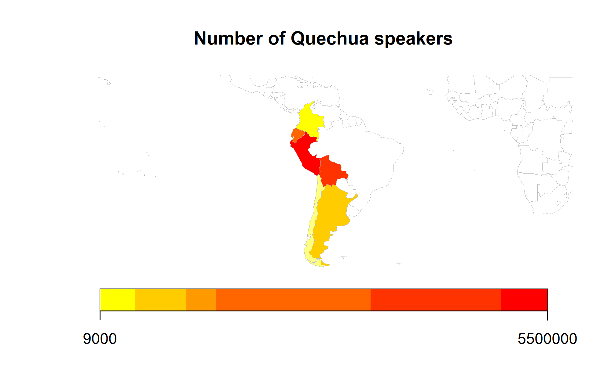

```{r}
#| label: setup
#| include: false
options(htmltools.dir.version = FALSE)
knitr::opts_chunk$set(
  fig.asp = 0.5625,
  out.width = "100%", 
  fig.retina = 2, 
  dpi = 300,
  message = F, 
  warning = F
  )

set.seed(20250223)

library("tidyverse")
library("here")
library("knitr")
library("flextable")
library("rworldmap")

theme_psllt <- function(...) {
  list(
    theme_bw(base_family = "Palatino", ...), 
    theme(
      plot.subtitle = element_text(color = "grey40"), 
      panel.grid.major = element_line(color = 'grey90', linewidth = 0.15),
      panel.grid.minor = element_line(color = 'grey90', linewidth = 0.15)
    )
  )
}

theme_set(theme_grey(base_size = 30))

```

```{r}
#| label: data
#| include: false

# create df for quechua-speaking populations based on Escudero (2011)

quechua_pop <- data.frame(
  country = c("CUB","PRI","CRI","ECU","HND","NIC","PAN",
              "ARG","BOL","CHL","COL","DOM","SLV","GTM",
              "MEX","PRY","PER","URY","VEN"),
  quechua = c("no","no","no","yes","no","no","no",
              "yes","yes","yes","yes","no","no","no",
              "no","no","yes","no","no"),
  num_speakers = c(NA,NA,NA,1500000,NA,NA,NA,
                                  1000000,4700000,9000,23000,NA,NA,NA,
                                  NA,NA,5500000,NA,NA)
)

#create map object
quechua_pop_map_object <- joinCountryData2Map(quechua_pop, joinCode = "ISO3", nameJoinColumn = "country")

# create map & export to png
png(
  here("assets", "quechua_speakers_map.png"),
  width = 2000,
  height = 1200,
  res = 300
)

mapCountryData(
  quechua_pop_map_object,
  nameColumnToPlot = "num_speakers",
  mapTitle = "Number of Quechua speakers",
  xlim = c(-80, -55),   # longitude
  ylim = c(-55, 20)     # latitude
)

dev.off()

```

# The Basics {.transition}

## What are we talking about today?

::: {.fragment .fade-up}
::: {.fragment .semi-fade-out}
History of Quechua-Spanish Contact [@escobar2011spanish]
:::
:::

::: {.fragment .fade-up}
::: {.fragment .semi-fade-out}
An overview of general contact phenomena [@escobar2011spanish]
:::
:::

::: {.fragment .fade-up}
::: {.fragment .semi-fade-out}
Contrastive focus in two Peruvian varieties [@o2012realization]
:::
:::

::: {.fragment .fade-up}
::: {.fragment .semi-fade-out}
Morphosyntactic contact-induced change in Spanish [@sanchez2004functional]
:::
:::

# History of Quechua-Spanish Contact {.transition}

## Number of Quechua Speakers



# General contact phonema {.transition}

# Focus in Contact {.transition}

# Morphosyntax in Contact {.transition}

## Thanks! {.final visibility="uncounted"}

{.absolute top="0" right="0" width="55" height="55"}


<table style="border-collapse: collapse; border: none;">
  
  <tr>
    <td style="text-align: right; padding-right: 10px;">
      <a href="mailto:ec1310@scarletmail.rutgers.edu"></a>
    </td>
    <td>ec1310@scarletmail.rutgers.edu</td>
  </tr>
  
  <tr>
    <td style="text-align: right; padding-right: 10px;">
      <a href="mailto:rme70@scarletmail.rutgers.edu"></a>
    </td>
    <td>rme70@scarletmail.rutgers.edu</td>
  </tr>

  <tr>
    <td style="text-align: right; padding-right: 10px;">
      <a href="https://www.jvcasillas.com/quarto-rutgers-theme/"></a>
    </td>
    <td>jvcasillas.com/quarto-rutgers-theme</td>
  </tr>

  <tr>
    <td style="text-align: right; padding-right: 10px;">
      <a href="https://robertespo.github.io/"></a>
    </td>
    <td>robertespo.github.io</td>
  </tr>

  <tr>
    <td style="text-align: right; padding-right: 10px;">
      <a href="https://github.com/RobertEspo"></a>
    </td>
    <td>\@RobertEspo</td>
  </tr>
  
  <tr>
    <td style="text-align: right; padding-right: 10px;">
      <a href="https://github.com/emcorregidor"></a>
    </td>
    <td>\@emcorregidor</td>
  </tr>
  
  <tr>
    <td style="text-align: right; padding-right: 10px;">
      <a href="emcorregidor.github.io/"></a>
    </td>
    <td>emcorregidor.github.io/</td>
  </tr>
  
</table>

## References {visibility="uncounted"}

::: {#refs .smaller}
:::